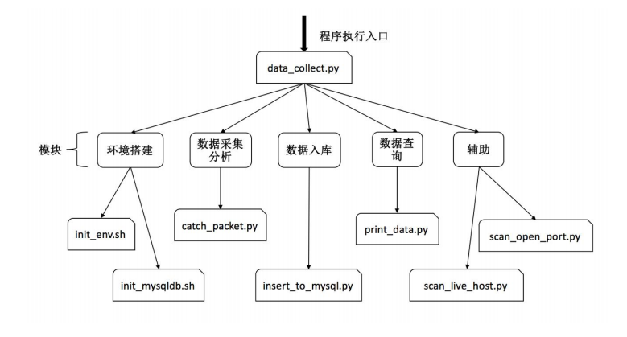
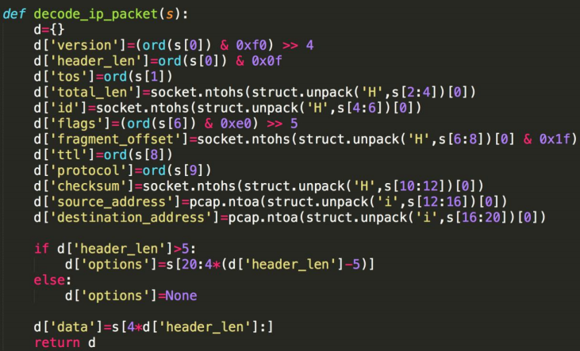
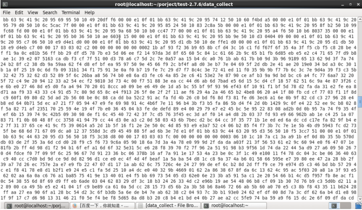

# data-flow-collect

## Description information
> The project is based on python to achieve TCP, UDP and ICMP data flow reorganization to be able to restore the received TCP, UDP and ICMP content, to restore it.

## Work ideas and programs
> The basic understanding of this architecture, the gateway to collect LAN data in the PC, python script processing, and then stored with the database, the browser displays the data to the user to view. 

(1) Detection of data packets When receiving a data packet, the first correctness check, such as TCP packet header is
complete, TCP data length is less than 0, the source address and destination address is 0 and so on. If it is correct, then the next step, otherwise this packet will be discarded. 

(2) Analysis of data packets 

**[Method 1]** 
- a. For each tcp packet, the packet's source address, destination address, source port number, destination port number out in the reloading of the table to find a vertical list There is no match with it linked list exists, if so, put the packet into the same socket with it in the chain, into the linked list, the first to find the sequence number in the list in the appropriate location, and then into ; If not, then in the creation of a new type of chain head node, and then put it in the newly created list. 

- b. Whenever a data segment in the chain, I check the data segment in the list has been in place, if it is, will be linked to all data segments of the data part of the stitching together, the application layer Message, and then release the list, and then repeat 1-2 steps; if not, repeat 1-2 steps directly. 

**[Method 2]**
- a. using python's third-party modules libpcap and dpkt to achieve. 

(3) Data storage data need to have stored media, you can not use the cache, because the computer's cache is not reliable, so here the use of mysql database on the analysis of data storage. In the database, the need to create tables and indexes for data storage and extraction. 

(4) Data reorganization through a certain method of data reorganization. 

(5) Data display The display of data obtained by using a web browser is performed.

## Project code structure

## Scripts list
- **`[date-flow-collect]`**
- [x] **data_collect.py** - Execute the entry file
 - **`[scripts]`**
 - [x] **init_env.sh** - Installs MySQLdb database
 - [x] **init_mysqldb.sh** - Installs and creates the required the MySQLdb database and table information
 - [x] **create_db.py** - creates the required the MySQLdb database and table information
 - [x] **catch_packet.py** - Collects data flow information about TCP、UDP、ICMP
 - [x] **insert_to_mysql.py** - The information collected into the database for preservation
 - [x] **print_data.py** - Print data flow information, more IP protocol id value to sort
 - **`[install_packages]`**
 - [x] **MySQL-python-1.2.3.zip** - pymysql
 - [x] **pylibpcap-0.6.4.zip** - pylibpcap
- [x] **LICENSE** - Apache License
- [x] **README.md** - readme.md

## The main code

## Show results

